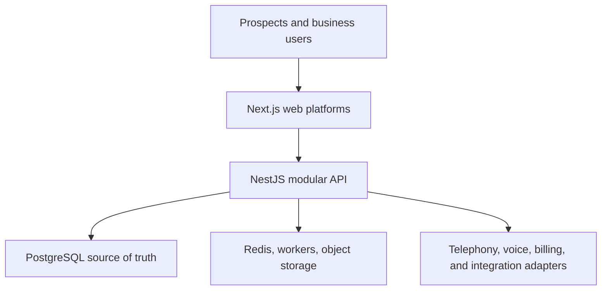
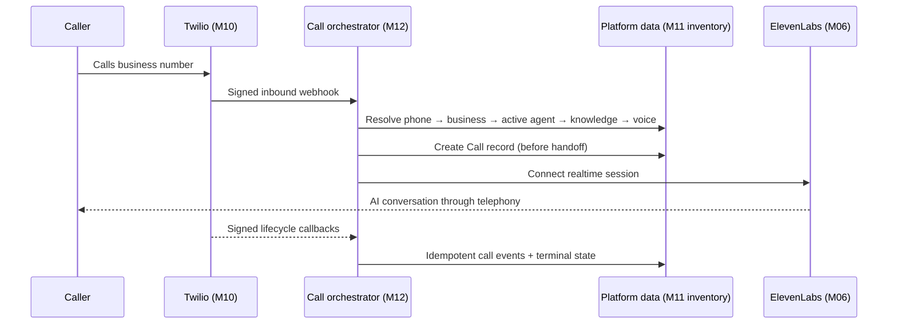
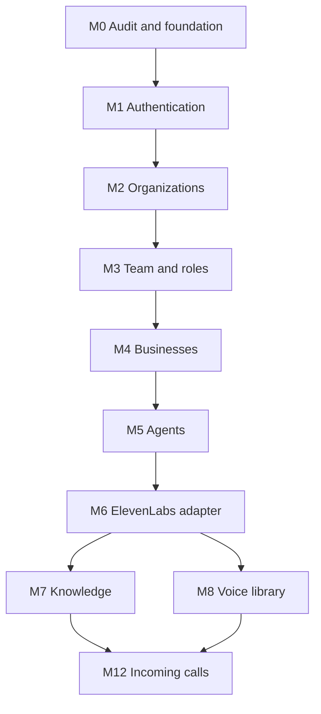

# EaziAiCall
## AI Receptionist SaaS — Target Architecture, Master Module Registry, and Module 0 Plan

| Document field | Value |
| --- | --- |
| Project | EaziAiCall |
| Version | 1.1 |
| Date | 24 August 2026 |
| Status | Architecture baseline; Module 0–3 Completed |
| Planning method | Vertical Slice Development / Feature-Based Incremental Development |
| Implementation tools | Cursor for production code; Lovable for approved UI/UX briefs |
| Production source of truth | GitHub repository |
| Product data source of truth | PostgreSQL |

## 1. Purpose and approval boundary

This document consolidates the confirmed architecture, the complete module registry, the dependency-led delivery sequence, and the detailed plan for **Module 0 — Existing Project Architecture Audit & SaaS Foundation Refactor**.

It does not authorize a rewrite, start implementation, or provide detailed implementation plans for later modules. The next implementation-planning document will be **Module 1 — Authentication**, but only after Module 0 is approved and completed.

### Confirmed constraints

- Preserve the existing NestJS, Next.js, PostgreSQL, Twilio, OpenAI Realtime, WebSocket, call-management, Docker, and n8n work wherever it is technically sound.
- Refactor the existing project incrementally; do not start a replacement project.
- Use a modular monolith for the current product stage; do not introduce premature microservices.
- Keep PostgreSQL as the authoritative SaaS data store.
- Keep provider-specific identifiers in mapping records, never as primary business identities.
- Design multi-tenancy and authorization into the foundation.
- Keep realtime call processing out of n8n.
- Complete one usable vertical slice and its Definition of Done before proceeding to the next.
- Treat all reported existing functionality as **unverified until Module 0 produces code and test evidence**.

## 2. Product and architecture summary

The product is a multi-tenant AI Receptionist SaaS. An organization can own one or more businesses; each business can configure one or more AI receptionists, knowledge sources, voices, phone numbers, business tools, customer records, and call workflows.

The initial commercial provider combination is:

- **Twilio** for phone numbers and telephony.
- **ElevenLabs** for the initial managed voice-agent experience.
- **The SaaS platform** for tenants, businesses, agents, configurations, provider mappings, knowledge-source originals, permissions, calls, transcripts, outcomes, integrations, usage, subscriptions, and business logic.

The existing custom OpenAI Realtime implementation remains a product asset and becomes an `OpenAIRealtimeProvider` adapter. It is not discarded merely because ElevenLabs is the initial commercial provider.

## 3. Current-state assessment

The current state below was verified on 24 August 2026 against the supplied `Ai-Agent-Call.zip` snapshot: branch `main`, commit `51736da` (`Add AI Call Agent fullstack scaffold`). Detailed evidence is recorded in the separate EaziAiCall Module 0 Codebase Audit.

### 3.1 Verified existing assets

| Area | Reported state | Initial disposition |
| --- | --- | --- |
| Backend | NestJS 11 modular prototype; production compilation passes | Retain and refactor |
| Realtime voice | Twilio media WebSocket bridge connected directly to OpenAI Realtime | Preserve behind the future `OpenAIRealtimeProvider` adapter |
| Telephony | Twilio incoming-call and call-ended endpoints generate TwiML and update calls | Retain behavior; secure and place behind telephony boundary |
| Call lifecycle | Idempotent creation by Twilio Call SID plus completion/duration update | Protect with tests; normalize provider identity and state transitions |
| Database | Six TypeORM entities: businesses, AI configs, calls, messages, recordings, and email logs; no migrations | Reconcile schema and introduce migration ownership immediately |
| Frontend | Next.js 16 routes for dashboard, calls, call detail, and settings; type-check passes | Retain shell/components; complete runtime/error contracts incrementally |
| Infrastructure | Docker Compose defines PostgreSQL, Redis, backend, frontend, and n8n; Redis/n8n application services are not implemented | Repair configuration, health checks, secrets, and service ownership |
| Tests/quality | Ten backend test files exist, but Jest/ts-jest incompatibility prevents execution; no frontend tests | Replace scaffold tests with runnable characterization and foundation coverage |
| Provider strategy | Current code is tightly coupled to Twilio/OpenAI and contains no ElevenLabs adapter | Introduce ports without discarding the prototype |

### 3.2 Likely usable after verification

- NestJS application bootstrap, TypeORM integration, and current module structure.
- Early call-domain entities and service behavior.
- Twilio TwiML generation and incoming/call-ended routing logic.
- OpenAI Realtime WebSocket and bidirectional audio-streaming implementation knowledge.
- Next.js project shell, dashboard layout, call table, and API client starting point.
- Dockerfiles and Compose topology as a starting point, not a production-ready deployment.

### 3.3 Areas requiring audit or controlled refactor

- Unconditional TypeORM `synchronize: true` and the complete absence of migrations.
- Tenant ownership on existing records and queries.
- Authentication, authorization, and route protection.
- Provider-specific imports or fields leaking into core business services.
- Webhook signature verification, replay protection, idempotency, and retry behavior.
- Secrets, environment-variable validation, and logging redaction.
- Stable error responses, request correlation, health checks, and observability.
- Frontend/backend contracts, API client patterns, loading/empty/error states, and route guards.
- Recording, transcript, and document retention rules.
- Broken backend test execution, placeholder dependency-injection tests, 529 backend lint findings, and absent frontend tests.
- Docker reproducibility and production-safe startup behavior.

### 3.4 Missing or not yet proven

- ~~End-to-end authentication and account recovery.~~ **Delivered in M1** (register, verify, login, session cookies, password reset, portal gate).
- ~~Organization/workspace model and demonstrable tenant isolation.~~ **Delivered in M2** (orgs, membership, active workspace, cross-tenant denial tests).
- Team invitations, roles, and permissions.
- Complete business and agent management.
- ElevenLabs adapter and synchronization.
- Owned knowledge-document storage and provider-independent knowledge metadata.
- Voice library, voice consent, and cloning workflow.
- Production-grade phone-number provisioning and assignment.
- Complete incoming-call journey with customer-visible transcript and summary.
- Usage metering, plans, billing, analytics, admin operations, and provider-cost controls.

## 4. Target architecture

### 4.1 Architecture principles

1. **Modular monolith first.** One NestJS product backend with explicit domain-module boundaries is the default. Workers may run as separate processes without becoming separate products.
2. **Ports and adapters for providers.** Core modules depend on provider-neutral interfaces; Twilio, ElevenLabs, OpenAI Realtime, Retell, Telnyx, Stripe, and n8n are adapters.
3. **PostgreSQL owns business truth.** Provider systems execute capabilities but do not own the SaaS identity model or authoritative configuration.
4. **Tenant context is explicit.** Tenant-owned data and operations must be scoped to an organization and, where applicable, a business.
5. **Realtime and asynchronous work are separated.** Audio and conversational turn handling stay on the realtime path; notifications, CRM sync, analytics, and other follow-up work use events and workers.
6. **Original data is portable.** Original knowledge documents and durable recordings, where legally permitted, remain in platform-controlled object storage.
7. **Migrations, not runtime synchronization.** Schema changes are reviewed, versioned, tested migrations.
8. **Incremental replacement.** Existing behavior is protected with characterization tests before structural refactoring.

### 4.2 System context



### 4.3 Product platforms

| Platform | Release position | Primary responsibility |
| --- | --- | --- |
| Marketing Website | MVP support track | Product, industries, pricing, demos, signup, login, and demo booking |
| Customer / Business Portal | MVP primary platform | Business, agent, knowledge, voice, phone, call, and account operations |
| Internal Admin Portal | Commercial launch | Tenant support, provider operations, usage, subscriptions, cost, errors, and audit access |
| Developer / Integration Portal | Future scale | API keys, documentation, webhooks, OAuth, logs, and SDK guidance |
| Help Center | Future scale | Setup documentation, troubleshooting, billing, and integration guides |
| Operations Console | Future scale | Live operations, queues, provider health, cost alerts, and incidents; initially part of Admin |

The platforms may share an approved design system and typed API client, but must not duplicate business logic or create independent backends/databases.

### 4.4 Backend shape

The NestJS backend remains a **feature-oriented modular monolith**. Each product module owns its application services, domain rules, persistence access, DTOs, authorization policies, tests, and public API contract.

| Layer | Responsibility | Must not do |
| --- | --- | --- |
| API / transport | HTTP, webhook, and WebSocket boundary; parsing; authentication context; response mapping | Contain provider orchestration or business rules |
| Application | Use cases, transactions, permissions, orchestration, domain events | Import concrete provider SDKs directly |
| Domain | Provider-neutral business entities, states, invariants, and policies | Depend on NestJS, Twilio, ElevenLabs, or database schemas |
| Infrastructure | TypeORM repositories, provider adapters, object storage, Redis, queues, email, logging | Become the owner of business decisions |

Recommended top-level feature boundaries are `identity`, `organizations`, `team`, `businesses`, `agents`, `knowledge`, `voices`, `telephony`, `calls`, `transcripts`, `analysis`, `tools`, `crm`, `automation`, `notifications`, `usage`, `billing`, `admin`, and `audit`. Exact folder names must follow the existing repository conventions confirmed in Module 0.

### 4.5 Data ownership

| Data class | Authoritative owner | Notes |
| --- | --- | --- |
| Organizations, businesses, users, roles | PostgreSQL | Stable platform UUIDs |
| Agents and configuration | PostgreSQL | Provider agent IDs stored only in mappings |
| Phone-number assignment | PostgreSQL | Provider owns the purchased resource; platform owns business assignment and intended state |
| Calls, states, outcomes, transcript index | PostgreSQL | Webhooks are normalized into platform call events |
| Original knowledge files | S3-compatible object storage | Metadata, version, hash, ownership, and sync status in PostgreSQL |
| Durable recordings | Object storage when permitted | Retention and consent rules required |
| Short-lived locks, rate counters, cache | Redis | Never the sole durable record |
| Provider execution state | Provider | Mirrored only where the product needs it; reconciled against desired platform state |
| Automation definitions and runs | PostgreSQL plus n8n execution | Platform records business ownership and important outcomes |

### 4.6 Multi-tenancy model

- **Organization** is the primary tenant, security, membership, and billing boundary.
- **Business** is an operational entity within an organization.
- **Agent** belongs to one business; deliberate future sharing must be modeled explicitly rather than assumed.
- Tenant-owned tables carry `organization_id`; business-level tables additionally carry `business_id` where appropriate.
- Every tenant query is scoped by an authenticated tenant context. Client-supplied organization IDs are never trusted by themselves.
- Foreign keys and composite uniqueness rules must prevent cross-tenant relationships.
- Background jobs, webhooks, and provider callbacks must resolve tenant ownership from trusted platform mappings.
- Cross-tenant admin access is a separate audited support capability, never an ordinary customer permission.
- PostgreSQL Row-Level Security is an explicit Module 0 decision gate. Application-level scoping and automated isolation tests are mandatory whether or not RLS is adopted.

### 4.7 Provider abstraction

Core services use capability-focused interfaces rather than a single oversized provider interface.

| Port | Initial adapter | Future adapters | Representative capabilities |
| --- | --- | --- | --- |
| `VoiceAgentProvider` | ElevenLabs | Retell, OpenAI Realtime | Create/update/archive provider agent, publish instructions, obtain status |
| `VoiceClonePort` | ElevenLabs IVC | Retell, custom | Create/delete provider clone from private samples |
| `VoiceCatalogProvider` | ElevenLabs | Retell, custom | List/preview voices, map selection, clone with consent evidence |
| `KnowledgeSyncProvider` | ElevenLabs | Custom RAG, Retell | Publish/update/remove source, check synchronization state |
| `TelephonyProvider` | Twilio | Telnyx | Search/provision/release numbers, configure routing, place call |
| `CallArtifactProvider` | ElevenLabs/Twilio as needed | Other providers | Retrieve normalized transcript, recording metadata, and provider outcome |
| `AutomationProvider` | n8n | Internal worker or other automation platform | Dispatch asynchronous workflow event and receive result |
| `BillingProvider` | Stripe (planned) | Future provider | Customer, subscription, invoice, and payment lifecycle |

Every mapping record should include the platform entity ID, provider key, external ID, provider status, synchronization status, last synchronized time, last error code, and non-secret metadata. Credentials are referenced through secure configuration; secrets must not be stored in ordinary mapping metadata.

### 4.8 Knowledge architecture

Knowledge customization uses base model capability plus industry configuration, agent instructions, business knowledge, and live tools. It does not default to fine-tuning.

1. A user creates a file, URL, FAQ, or text knowledge source.
2. The platform stores ownership, type, version, content hash, and original file location.
3. An asynchronous synchronization job publishes the source to the selected knowledge provider.
4. The provider mapping stores the external source ID and sync status.
5. Agent activation checks that required knowledge and configuration are synchronized.
6. Provider changes can replay the platform-owned sources without asking the customer to upload them again.

Static knowledge belongs in RAG. Availability, reservations, appointments, inventory, payments, and CRM state must come from live tools/APIs.

### 4.9 Incoming-call flow (FINAL MVP routing lock — 28 August 2026)

Canonical reference: [`docs/telephony-inbound-routing-lock.md`](../docs/telephony-inbound-routing-lock.md).

**Ownership hierarchy**

```text
Organization
└── Business
    ├── Phone Numbers (M11) → Active Agent Assignment
    ├── Shared Knowledge (M07) · Shared Voice Library (M08) · Cloned Voices (M09, optional)
    └── Agents (M05) → Assigned Knowledge · Selected Voice · Language · ElevenLabs mapping (M06)
```

**Runtime path (M12 orchestration)**

```text
Caller → Twilio (M10) → Phone Number record (M11) → Business → Assigned Active Agent
→ Agent config + assigned Knowledge + selected Voice → ElevenLabs (M06) → Conversation
→ EaziAICall Call + Call Events
```

**Module split:** M10 = telephony provider adapter only. M11 = canonical phone inventory + assignment. M12 = runtime resolution, early Call record creation, provider handoff, idempotent webhooks, failure routes. n8n is **not** in the realtime audio path.



After the call transaction is durably recorded, asynchronous events may trigger summary enrichment, notifications, CRM updates, analytics, or n8n workflows. Failure of an asynchronous action must not corrupt the call record or block realtime audio.

### 4.10 Event and worker architecture

- Start with PostgreSQL-backed durable job/outbox patterns plus Redis-backed workers where useful; do not add Kafka for the MVP.
- Store a unique provider event identity for webhook idempotency.
- Use retry policies with bounded exponential backoff and dead-letter visibility.
- Events carry trusted `organization_id`, `business_id`, correlation ID, event version, and aggregate identity.
- n8n receives approved business events; it is not given responsibility for authoritative call or billing state.
- Consumers must be idempotent because provider and queue deliveries can repeat.

### 4.11 API and frontend contracts

- Version public application APIs, beginning with `/api/v1` unless the existing API has a documented compatible convention.
- Generate and maintain OpenAPI documentation from validated DTOs.
- Use stable machine-readable error codes with a correlation ID; do not expose secrets or raw provider errors.
- Verify provider webhook signatures on the raw body before normalization.
- Use a single typed frontend API-client pattern with centralized auth/session handling.
- Feature pages must include loading, empty, validation, permission-denied, provider-failure, and retry states.
- Preserve the existing Next.js router and component strategy unless Module 0 identifies a concrete reason to migrate it.

### 4.12 Security and compliance baseline

- Passwords use an established adaptive password-hashing library; session/token design is finalized in Module 1.
- Secrets are validated at startup and redacted from logs.
- Provider webhooks require signature verification, timestamp/replay checks where supported, and idempotency.
- Authorization is deny-by-default at the API boundary and enforced again in application use cases.
- Knowledge files, recordings, transcripts, and exports use least-privilege access and time-limited download links.
- Voice cloning requires explicit consent evidence, auditability, revocation handling, and provider-policy compliance.
- Recording and transcript retention must be configurable by jurisdiction and customer policy before commercial use.
- Logs include request/call correlation but must not contain access tokens, raw credentials, or unnecessary sensitive transcript content.

### 4.13 Deployment topology

The MVP can use the same codebase with independently scalable runtime roles:

- Next.js web application(s).
- NestJS API/webhook service.
- Realtime/voice process if existing load or connection behavior justifies separation.
- Background worker process.
- PostgreSQL.
- Redis.
- S3-compatible object storage.
- n8n for approved asynchronous automations.

This is a deployment separation, not a requirement to create microservices. Each environment must have explicit configuration, migrations, health checks, backup expectations, and rollback instructions.

## 5. Architecture decision register

| ADR | Decision | Reason | Important tradeoff / review trigger |
| --- | --- | --- | --- |
| ADR-001 | NestJS modular monolith | Fastest controlled path from existing code with strong boundaries | Split a module only when measured scale, ownership, or reliability requires it |
| ADR-002 | Next.js/React/TypeScript frontend | Confirmed stack and existing work | Avoid independent Lovable backend/data services |
| ADR-003 | PostgreSQL is the SaaS source of truth | Transactions, relational ownership, portability | Provider state needs reconciliation rather than blind trust |
| ADR-004 | Ports/adapters for external providers | Reduces lock-in and preserves OpenAI Realtime work | Abstraction must follow real shared capabilities, not hide every provider difference |
| ADR-005 | Redis is non-authoritative | Appropriate for cache, locks, limits, and workers | Durable outcomes must be written to PostgreSQL/object storage |
| ADR-006 | Original knowledge in object storage | Provider portability and customer data ownership | Requires retention, malware scanning, and lifecycle policies |
| ADR-007 | Realtime path excludes n8n | Predictable latency and availability | Async actions receive events after durable state changes |
| ADR-008 | RAG plus live tools before fine-tuning | Easier control and fresh dynamic data | Fine-tuning is reconsidered only with measured use cases |
| ADR-009 | Migration-owned schema; no production auto-sync | Safe, reviewable database evolution | Requires migration discipline in every vertical slice |
| ADR-010 | Tenant context plus isolation tests are mandatory | Prevents the highest-impact SaaS data risk | PostgreSQL RLS adoption remains a Module 0 evidence-based decision |

## 6. Master module registry

### 6.1 Registry conventions

- **MVP:** required for the market-testable incoming-call journey.
- **MVP Optional:** can be feature-flagged or deferred without blocking the base journey.
- **Commercial:** needed for a sellable, operable, and monetized launch or for the selected first industry vertical.
- **Future:** scale, provider expansion, or controlled intelligence improvement.
- **P0:** blocking/foundation; **P1:** high; **P2:** normal; **P3:** later.
- **Status:** Module 0 is `Completed` (24 August 2026). Module 1 is `Completed` (25 August 2026). Module 2 is `Completed` (25 August 2026). Module 3 is `Completed` (25 August 2026). All others are `Not Started` until their Definition of Done is met.
- **Delivery:** Work owns requirements/architecture; Cursor owns implementation/tests; Lovable supports approved UI/UX modules.

| ID | Module | Phase | Release class | Priority | Dependencies | Status |
| --- | --- | --- | --- | --- | --- | --- |
| M0 | Existing Project Audit & SaaS Foundation Refactor | 0 | MVP | P0 | None | Completed |
| M1 | Authentication | 1 | MVP | P0 | M0 | Completed |
| M2 | Organizations / Tenants | 1 | MVP | P0 | M1 | Completed |
| M3 | Users, Team & Roles | 1 | MVP | P0 | M1, M2 | Completed |
| M4 | Business Management | 1 | MVP | P0 | M2, M3 | Completed |
| M5 | Agent Management | 2 | MVP | P0 | M4 | Complete — 27 August 2026 |
| M6 | ElevenLabs Voice-Agent Provider | 2 | MVP | P0 | M0, M5 | Complete — 27 August 2026 |
| M7 | Knowledge Base | 3 | MVP | P0 | M4, M5, M6 | Complete — 27 August 2026 |
| M8 | Voice Library | 3 | MVP | P0 | M5, M6 | Complete — 28 August 2026 |
| M9 | Voice Cloning & Consent | 3 | MVP Optional | P1 | M3, M5, M6, M8 | Complete — 28 August 2026 |
| M10 | Twilio Telephony Provider | 4 | MVP | P0 | M0 | **Complete** (28 August 2026) |
| M11 | Phone Number Management | 4 | MVP | P0 | M4, M5, M10 | **Complete** — 28 August 2026 |
| M12 | Incoming AI Calls | 5 | MVP | P0 | M6, M7, M8, M10, M11 (M9 optional) | Not Started (12.01 roadmap locked) |
| M13 | Outbound Calls | 5 | Commercial | P1 | M12, M20, M23 | Not Started |
| M14 | Call Management | 5 | MVP | P0 | M12 | Not Started |
| M15 | Transcripts | 5 | MVP | P0 | M12, M14 | Not Started |
| M16 | Call Summary & Analysis | 5 | MVP | P0 | M15 | Not Started |
| M17 | Generic Tool Framework | 6 | Commercial | P1 | M5, M12 | Not Started |
| M18 | Appointment Booking | 6 | Commercial — vertical choice | P1 | M17 | Not Started |
| M19 | Restaurant Reservations | 6 | Commercial — vertical choice | P1 | M17 | Not Started |
| M20 | Customer / CRM | 7 | Commercial | P1 | M4, M14 | Not Started |
| M21 | Knowledge Gap Detection & Approval | 7 | Future | P2 | M7, M15, M16, M20 | Not Started |
| M22 | Automation Engine / n8n | 8 | Commercial | P1 | M14, M17, M23 | Not Started |
| M23 | Notifications | 8 | Commercial | P1 | M3, M4 | Not Started |
| M24 | Analytics | 9 | Commercial | P1 | M14, M16, M20, M26 | Not Started |
| M25 | Subscription Plans & Entitlements | 9 | Commercial | P0 | M2, M3 | Not Started |
| M26 | Usage Metering | 9 | Commercial | P0 | M6, M10–M12, M25 | Not Started |
| M27 | Billing | 9 | Commercial | P0 | M23, M25, M26 | Not Started |
| M28 | Internal Admin Portal | 9 | Commercial | P1 | M2, M3, M14, M26, M27 | Not Started |
| M29 | Security, Audit & Monitoring | Cross-cutting | MVP baseline + Commercial hardening | P0 | Begins in M0; enforced in every module | Not Started |
| M30 | Additional Providers | 10 | Future | P2 | M5, M10, M29 plus relevant mature domains | Not Started |

### 6.2 Important registry decisions

- M29 is not postponed: its **minimum controls are acceptance criteria inside every earlier module**. The separately tracked M29 release completes commercial hardening, centralized audit/search, operational monitoring, alerting, and compliance controls.
- M9 is optional for the first market test if selecting an existing compliant voice is sufficient. No voice clone may be released without consent and audit controls.
- Commercial launch must select at least one action vertical—typically M18 or M19—rather than building every industry workflow simultaneously.
- M26 precedes M27 because accurate usage must exist before usage-based billing or overages.
- Module numbers describe the product registry. The approved implementation sequence can place a dependency before a lower-numbered nondependency.

## 7. Dependency-led delivery roadmap

### 7.1 First-module dependency chain



M12 also requires **M06, M07, M08, M10, and M11** (M09 optional when Agent uses cloned voice). M10 can begin only after M0; under the agreed one-module-at-a-time method, it is completed after the voice/knowledge foundation and before M11.

### 7.2 Exact market-testable MVP sequence

1. M0 — Audit and foundation refactor.
2. M1 — Authentication.
3. M2 — Organizations / tenants.
4. M3 — Team and roles.
5. M4 — Business management.
6. M5 — Agent management.
7. M6 — ElevenLabs provider.
8. M7 — Knowledge base.
9. M8 — Voice library.
10. M9 — Voice cloning only if required for the first market test; otherwise place behind a disabled entitlement.
11. M10 — Twilio provider.
12. M11 — Phone-number management.
13. M12 — Incoming AI calls.
14. M14 — Call management.
15. M15 — Transcripts.
16. M16 — Call summary and analysis.

M29 security, audit, and monitoring controls are applied as release gates throughout these steps.

### 7.3 Commercial launch sequence

After MVP validation, the recommended sequence is M23 Notifications, M17 Generic Tool Framework, one selected vertical module (M18 or M19), M20 CRM, M13 Outbound Calls if legally and commercially required, M22 Automation, M25 Plans, M26 Usage, M27 Billing, M24 Analytics, M28 Admin Portal, and M29 commercial hardening.

The exact order of M13, M18/M19, and M20 can change based on the chosen first customer vertical, but dependencies and module Definition of Done cannot be bypassed.

### 7.4 Future-scale sequence

- M21 controlled knowledge-gap detection after sufficient transcript/outcome evidence exists.
- M30 additional providers after provider contracts have been proven by the initial adapters.
- Developer Portal when public integrations become a product capability.
- Help Center when onboarding and support patterns stabilize.
- Dedicated Operations Console only when operational scale justifies separating it from Admin.

## 8. Market-testable MVP boundary

The MVP is accepted only when a real business user can complete this journey without database edits or engineering intervention:

1. Register and verify an account.
2. Create an organization and business.
3. Configure an AI receptionist.
4. Add business knowledge and verify synchronization.
5. Select an approved voice; optionally complete a consented clone.
6. Connect and assign a phone number.
7. Test and activate the receptionist.
8. Receive a real incoming phone call.
9. Answer using correct business knowledge with natural turn-taking.
10. End the call cleanly.
11. Display the correct call status, duration, transcript, and summary to the authorized business user.

### MVP exit gates

- Two test organizations complete the journey with automated proof that neither can access the other's data.
- Duplicate/out-of-order provider webhooks do not create duplicate calls or corrupt state.
- Provider timeout, invalid configuration, failed knowledge sync, and disconnected call paths are visible and recoverable.
- Required webhook signatures, route permissions, secret redaction, audit events, health checks, backups, and tested migrations are active.
- Usage and provider cost may be internally observable, but customer billing is not required for the market-test MVP.
- No module is considered complete with backend-only implementation or UI mock data.

## 9. Module 0 — Existing Project Architecture Audit & SaaS Foundation Refactor

### 9.1 Objective

Produce a verified baseline of the existing application, protect useful behavior with tests, remove unsafe foundation practices, establish provider-neutral boundaries, and make the repository safe for end-to-end vertical-slice development—without building Authentication or later product features.

### 9.2 Outcomes

At completion:

- The team knows exactly what exists, runs, fails, is duplicated, and is unused.
- The project starts reproducibly from documented commands in a clean development environment.
- Database evolution is migration-owned and production-safe.
- Existing Twilio and OpenAI Realtime code is preserved behind or ready to move behind provider ports.
- Configuration, logs, errors, health endpoints, object-storage access, Redis access, and core test infrastructure follow one documented pattern.
- Existing call behavior has regression evidence.
- Architectural decisions and the first Cursor handoff are based on repository facts, not assumptions.

### 9.3 Scope included

#### Work package M0-A — Repository and runtime audit

- Inventory applications, packages, modules, routes, WebSocket gateways, entities, migrations, tests, scripts, and deployments.
- Identify package manager, Node versions, NestJS/Next.js/TypeORM versions, and incompatible or vulnerable dependencies.
- Run backend, frontend, database, and reported call-flow tests in a controlled development environment.
- Document current entry points, ports, required environment variables, external dependencies, and startup order.
- Record dead code, duplicate abstractions, circular dependencies, broken imports, and missing tests.

#### Work package M0-B — Current behavior and disposition map

- Create a capability matrix: Working, Partially Working, Broken, Unused, or Not Present.
- For each important component, decide Retain, Refactor, Replace Later, or Remove with approval.
- Add characterization tests around working call lifecycle, webhook normalization, WebSocket control messages, and database writes before refactoring them.
- Capture a repeatable baseline result, including known failures that are explicitly accepted for later modules.

#### Work package M0-C — Module boundaries and provider ports

- Establish feature-module dependency rules for the modular monolith.
- Define capability-focused provider ports and normalized provider error categories.
- Move direct Twilio/OpenAI SDK dependencies out of core/domain services where this can be done without changing behavior.
- Wrap the existing OpenAI Realtime work as, or prepare it for, `OpenAIRealtimeProvider`.
- Wrap existing Twilio behavior as, or prepare it for, `TwilioTelephonyProvider`.
- Add test doubles for provider ports so product modules can be tested without paid calls.
- Do not implement ElevenLabs functionality in M0; that belongs to M6.

#### Work package M0-D — Configuration and secrets

- Define a typed, startup-validated configuration schema.
- Separate local, test, staging, and production requirements.
- Remove secret values from tracked files and provide sanitized example variables.
- Fail fast for required configuration; allow explicitly optional provider configuration when that provider is disabled.
- Redact credentials, authorization headers, provider tokens, and sensitive payload fields from logs.

#### Work package M0-E — Database safety

- Inventory actual database schema, entities, migration files, constraints, and indexes.
- Reconcile drift between TypeORM entities and the development database.
- Create an approved baseline/migration strategy that preserves existing data.
- Disable automatic schema synchronization outside an explicitly disposable local mode.
- Test forward migration against a copy of the current schema and document rollback/restore steps.
- Define UUID identity, timestamp, soft-delete, tenant-key, and provider-mapping conventions.
- Do not create the final organization/business schema here unless a minimum compatibility change is required and approved; M2 and M4 own those domain models.

#### Work package M0-F — Supporting infrastructure

- Provide a single Redis connection pattern with health reporting.
- Provide an S3-compatible object-storage port and nonproduction implementation/configuration.
- Standardize background-worker bootstrap and retry configuration without building future automation workflows.
- Document where durable state lives and verify Redis/object storage are not treated as PostgreSQL replacements.

#### Work package M0-G — API, errors, logging, and health

- Add request/correlation IDs across HTTP, webhook, WebSocket, and worker logs.
- Establish structured logging and sanitized provider-error translation.
- Establish a stable application error shape with machine-readable codes.
- Provide liveness and readiness endpoints; readiness checks only critical dependencies.
- Define API versioning and OpenAPI generation policy.
- Define webhook raw-body handling, signature-verification boundary, event identity, and idempotency conventions.

#### Work package M0-H — Frontend foundation

- Verify existing dashboard, calls, call-detail, and settings routes.
- Repair only foundation-level build/import/configuration errors needed for a clean baseline.
- Establish the shared API-client, environment configuration, error mapping, and route-organization convention.
- Document the UI state standard: loading, empty, validation, permission, error, retry, and success.
- Do not redesign or implement future pages.

#### Work package M0-I — Reproducibility, tests, and CI checks

- Provide safe local startup through documented scripts and Docker where appropriate.
- Define lint, type-check, unit, integration, build, migration, and smoke-test commands.
- Ensure tests use isolated databases/provider mocks and do not call paid production services by default.
- Add a CI quality gate appropriate to the current repository.
- Create a release/runbook baseline covering startup, migration, health verification, and rollback.

#### Work package M0-J — Architecture evidence and handoff

- Deliver the audit report, target/reality gap map, repository map, entity/schema inventory, API inventory, provider inventory, risks, ADRs, and approved refactor backlog.
- Produce a Cursor implementation brief with exact files only after repository inspection.
- Record every deferred issue under its owning later module.
- Update the Master Module Registry statuses using evidence.

### 9.4 Explicitly out of scope

- Registration, login, password reset, email verification, or session UI.
- Organization, invitation, team, role, or business management features.
- ElevenLabs agent creation or knowledge synchronization.
- Voice selection or cloning.
- Phone-number purchase/release UI.
- New incoming/outbound call product features beyond preserving the existing baseline.
- Appointment, reservation, CRM, automation, notification, analytics, subscription, billing, or admin features.
- A full visual redesign.
- Microservice extraction, Kubernetes, Kafka, or multi-region deployment.
- Destructive database cleanup without a separate reviewed migration and recoverable backup.

### 9.5 Module 0 requirements

| ID | Requirement |
| --- | --- |
| M0-FR-001 | A new developer can install and start the audited frontend, backend, and required local dependencies from documented commands. |
| M0-FR-002 | The audit lists every application, feature module, route, webhook, gateway, entity, migration, test group, provider integration, and deployment artifact. |
| M0-FR-003 | Every reported existing capability has a status and reproducible evidence or a documented blocker. |
| M0-FR-004 | Existing working call behavior is protected by automated characterization/smoke tests before related refactoring. |
| M0-FR-005 | Core/application code depends on provider ports rather than concrete Twilio/OpenAI SDK clients. |
| M0-FR-006 | Existing OpenAI Realtime assets are retained and mapped to the future adapter architecture. |
| M0-FR-007 | Provider mappings use platform IDs plus provider/external IDs; provider IDs are not domain primary keys. |
| M0-FR-008 | Configuration is typed, validated, environment-aware, and documented without committing secrets. |
| M0-FR-009 | Production and staging startup cannot enable unsafe TypeORM schema synchronization. |
| M0-FR-010 | The migration plan is tested on a representative copy of the current schema without unapproved data loss. |
| M0-FR-011 | PostgreSQL, Redis, and object-storage responsibilities are explicit and have health/configuration checks. |
| M0-FR-012 | Logs and errors carry correlation IDs and redact secrets/sensitive fields. |
| M0-FR-013 | Liveness/readiness endpoints return documented results and fail correctly when critical dependencies are unavailable. |
| M0-FR-014 | Frontend and backend pass the agreed build, lint, type-check, and baseline test commands. |
| M0-FR-015 | All deferred findings have severity, owner module, recommended action, and release impact. |

### 9.6 Nonfunctional requirements

- **No regression:** retained call/stream behavior must produce equivalent observable outcomes after refactoring.
- **Recoverability:** database changes have a tested restore/rollback path; no destructive operation runs from ordinary application startup.
- **Security:** secrets and production credentials are absent from source, fixtures, logs, and test output.
- **Test isolation:** default automated tests use mocks/sandboxes and cannot trigger billable production calls.
- **Observability:** a single correlation ID connects request, provider operation, webhook, job, and error where those stages exist.
- **Portability:** local services can use compatible nonproduction infrastructure without changing domain code.
- **Maintainability:** new feature modules follow explicit allowed dependency directions and do not create circular imports.

### 9.7 Deliverables and evidence

| Deliverable | Required evidence |
| --- | --- |
| Current-state audit report | File/module inventory, versions, status matrix, commands, screenshots/log excerpts where helpful |
| Repository architecture map | Applications, shared packages, module ownership, dependency exceptions |
| Database assessment | Entity/schema comparison, migration list, drift report, backup and migration test results |
| Provider assessment | Current Twilio/OpenAI touchpoints, direct SDK imports, mapping gaps, adapter plan |
| Regression baseline | Automated results for existing call/webhook/WebSocket/database behaviors |
| Foundation refactor | Reviewed code with equivalent behavior and provider-neutral dependency direction |
| Configuration standard | Validated schema, sanitized example file, environment matrix, secret ownership |
| Runtime standard | Local startup/runbook, health endpoints, logs, error contract, dependency checks |
| Frontend baseline | Clean build, verified existing routes, shared API/error convention |
| Updated governance | ADRs, API/provider/risk registries, deferred backlog, module-status changes |

### 9.8 Acceptance criteria

Module 0 is accepted only when all criteria below are demonstrated:

1. **Clean start:** Given a clean supported development machine and the documented prerequisites, when the startup instructions are followed, then the required local services, backend, and frontend start without undocumented manual edits.
2. **Verified inventory:** Given the repository, when the audit output is compared with route/module/entity discovery, then no production application or external-provider integration is omitted.
3. **Evidence-based status:** Given each reported capability, when its audit record is opened, then it includes a reproducible command/test, observable result, or explicit blocker.
4. **Behavior protection:** Given the existing working call lifecycle, when characterization tests run before and after refactoring, then the agreed call states and stored outcomes remain equivalent.
5. **Provider boundary:** Given a core/application service, when its dependencies are inspected, then it imports a provider port/token and not a concrete Twilio, ElevenLabs, Retell, Telnyx, or OpenAI SDK.
6. **OpenAI preservation:** Given the existing OpenAI Realtime work, when the refactor disposition is reviewed, then no working asset is deleted and its adapter path and test evidence are documented.
7. **Database safety:** Given staging/production configuration, when the application starts, then automatic schema synchronization cannot run.
8. **Migration proof:** Given a representative copy of the existing database, when the approved migrations are applied, then they complete without unapproved loss and the restore/rollback procedure is demonstrated.
9. **Configuration failure:** Given a missing required variable, when the application starts, then it fails fast with a safe actionable message that does not reveal secret values.
10. **Log safety:** Given requests containing credentials or provider authorization data, when logs are inspected, then secrets are redacted and a correlation ID is present.
11. **Webhook standard:** Given a provider callback, when it reaches the platform boundary, then the design provides raw-body signature verification, normalized event identity, tenant resolution through trusted mappings, and idempotency handling.
12. **Health behavior:** Given healthy dependencies, readiness reports success; given an unavailable critical dependency, readiness reports failure while liveness continues to reflect process health.
13. **Provider-free tests:** Given the default test command, when it runs, then it cannot place a paid call or use production provider credentials.
14. **Quality gate:** Given the final branch, when lint, type-check, unit tests, integration tests, production builds, and migration verification run, then all required checks pass or an approved exception is documented with owner and deadline.
15. **Deferred ownership:** Given every unresolved finding, when the backlog is reviewed, then it has severity, risk, recommended action, owning module, and MVP/commercial impact.
16. **No scope leakage:** Given Module 0 changes, when reviewed against this plan, then Authentication, ElevenLabs feature development, billing, and unrelated product UI have not been implemented.

### 9.9 Definition of Done

| Standard DoD item | Module 0 completion condition |
| --- | --- |
| Requirements finalized | This plan and all audit decision gates are approved |
| User/developer stories defined | Audit, developer, operator, and maintainer outcomes are documented |
| Acceptance criteria defined | Section 9.8 is approved and traceable to evidence |
| Database migration completed | Baseline/repair migrations approved and tested where required |
| Entities/models completed | Foundation conventions and any necessary mapping/infrastructure entities are reviewed |
| Backend services completed | Foundation configuration, provider ports, health, logging, and error behavior are complete |
| APIs completed | Health/error/versioning baseline and existing API inventory are documented and tested |
| Validation completed | Configuration and touched transport DTOs are validated |
| Authentication/authorization completed | N/A for product auth; no new endpoint may become unintentionally public; auth design is deferred to M1 |
| Frontend UI completed | Existing foundation routes build and run; no new feature UI required |
| Frontend API integration completed | Shared API/config/error convention is functioning for retained screens |
| Loading/empty/error states completed | Standard documented; touched retained screens meet it where applicable |
| Unit tests completed | Foundation and provider-port behavior covered |
| Integration tests completed | Database, configuration, webhook boundary, and critical infrastructure behavior covered |
| End-to-end tests completed | Baseline smoke journey runs to the extent the current product supports it; gaps are assigned |
| Manual QA completed | Startup, retained pages, and reported call behavior checked in the audited environment |
| Security review completed | Secrets, logs, webhook boundary, dependency findings, and unsafe DB behavior reviewed |
| Documentation updated | Audit, runbook, ADRs, registries, risk log, and architecture map committed |
| CI/build validation completed | Required commands pass from a clean checkout |
| Regression check completed | Pre/post behavior evidence is attached |
| Product-owner approval completed | Module 0 evidence is reviewed and approved before M1 begins |

### 9.10 Decision gates requiring explicit approval during Module 0

1. Retain TypeORM or approve a migration only if the audit finds a material blocker. Default: retain TypeORM.
2. Adopt PostgreSQL RLS now, later, or not at all based on demonstrated operational/test compatibility. Tenant-scoped services and isolation tests remain mandatory.
3. Confirm monorepo/package-manager/workspace conventions from the existing repository.
4. Confirm whether realtime handling remains inside the API process or runs as a separate process from the same codebase.
5. Confirm object-storage provider for each environment while preserving an S3-compatible port.
6. Confirm any proposed deletion, schema cleanup, or incompatible API change separately; none is implied by this plan.

### 9.11 Module 0 risks and controls

| Risk | Impact | Control |
| --- | --- | --- |
| Existing behavior is undocumented | Regression during refactor | Characterization tests before structural edits |
| Entity/database drift | Data loss or failed deployment | Schema inventory, backup, tested baseline migrations, no production auto-sync |
| Provider logic is deeply coupled | Slow future provider expansion | Incremental ports/adapters; no big-bang rewrite |
| Secrets exist in history/config | Provider and customer exposure | Rotate compromised values, validate config, redact logs; never echo secrets in reports |
| Webhook duplication/reordering | Duplicate or incorrect call state | Unique event identity, idempotent transitions, ordering-aware state rules |
| Tenant ownership is absent | Cross-customer data exposure | Record as P0; define conventions in M0 and implement/prove in M2 before customer data |
| Tests place paid calls | Uncontrolled cost and side effects | Provider mocks by default; explicit sandbox smoke command only |
| Foundation work expands indefinitely | MVP delay | Enforce out-of-scope list and assign each finding to an owning module |

### 9.12 Recommended Module 0 execution order

1. Freeze the baseline and create recoverable database/configuration backups.
2. Inventory repository, runtime, database, routes, providers, and deployments.
3. Reproduce current frontend/backend/call behavior and record failures.
4. Add characterization tests for behavior that must survive.
5. Approve disposition map and decision gates.
6. Implement migration/configuration/logging/error/health foundations.
7. Introduce provider ports and move existing integrations incrementally.
8. Establish frontend API/config/error foundation.
9. Complete build/test/CI/runbook validation from a clean checkout.
10. Update registries, risks, ADRs, and Module 0 evidence; obtain approval.

## 10. Governance after approval

- Work maintains the PRD, architecture, ADRs, module registry, dependencies, database/API/provider registries, risk register, and handoff briefs.
- Cursor receives one approved module brief at a time with exact files, migrations, APIs, tests, authorization, acceptance criteria, and out-of-scope items.
- Lovable receives only approved frontend requirements for the active module and must respect the existing Next.js application and API contracts.
- GitHub remains the production-code source of truth.
- A module status changes only when evidence satisfies the status gate; `Completed` requires the full Definition of Done.

## 11. Approval requested

Approval of this document confirms:

1. The target architecture and architectural principles.
2. The Master Module Registry and release classifications.
3. The dependency-led MVP sequence.
4. The market-testable MVP boundary.
5. Module 0 scope, exclusions, acceptance criteria, and Definition of Done.

The repository-specific **EaziAiCall Module 0 Cursor Audit & Foundation Refactor Brief** is now available. After approval, Cursor should execute only that brief. Module 1 Authentication planning begins only after Module 0 has passed its Definition of Done.
