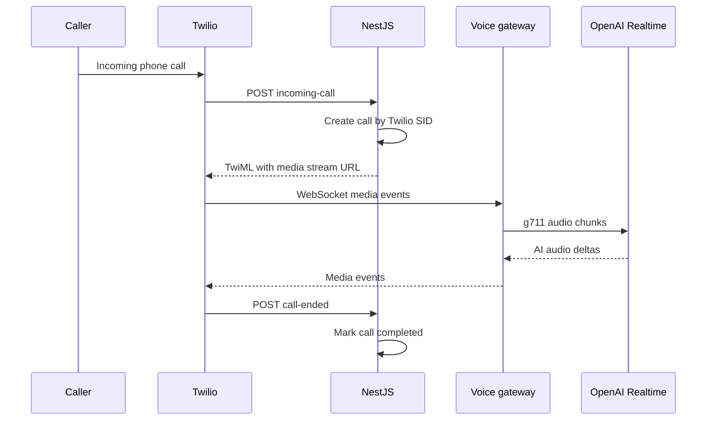

# EaziAiCall — Module 0 Codebase Audit

| Field | Value |
| --- | --- |
| Project | EaziAiCall |
| Audit date | 24 August 2026 |
| Source | `Ai-Agent-Call.zip` |
| Git snapshot | `main` at `51736da` — 5 June 2026 |
| Audit type | Static code/configuration review plus local build, type-check, lint, and test-start validation |
| Overall decision | Retain the prototype and perform a controlled foundation refactor |
| Module 0 status | Ready for Development; not completed |

## 1. Executive verdict

The supplied repository is a useful **single-business technical prototype**. It proves the central technical idea: Twilio can accept an incoming call, stream audio through a NestJS WebSocket gateway to OpenAI Realtime, send AI audio back to Twilio, and create/update an early call record in PostgreSQL.

It is **not yet a multi-tenant SaaS or production-ready AI receptionist**. Authentication, organizations, tenant isolation, provider abstraction, database migrations, webhook verification, WebSocket authorization, durable transcript processing, usable tests, Redis integration, object storage, health checks, and commercial ElevenLabs support are absent or incomplete.

The correct strategy remains:

```text
Existing prototype
→ protect working behavior
→ repair the foundation
→ introduce provider ports
→ continue one vertical slice at a time
```

No rewrite is recommended.

## 2. Audit scope and limitations

### Reviewed

- Repository and Git metadata supplied in the archive.
- Backend source, entities, configuration, tests, Dockerfile, and dependencies.
- Frontend routes, components, API client, configuration, Dockerfile, and dependencies.
- Docker Compose topology and environment-variable structure.
- Current planning and architecture Markdown documents.
- Local backend compilation, backend lint, backend test startup, frontend lint, and frontend TypeScript validation.

### Not executed

- Live Twilio or OpenAI calls; supplied provider values are placeholders.
- A database-connected API runtime; no representative database dump was supplied.
- Docker Compose runtime; Docker is unavailable in the audit environment.
- Frontend production compilation; the archive contains Windows-only Next.js SWC binaries, while the audit runtime is Linux.
- Network-dependent vulnerability scanning or package upgrades.
- ElevenLabs behavior; no ElevenLabs package or adapter exists.

These limitations do not change the architectural findings, but runtime behavior must be revalidated by Cursor in the project’s normal Docker/development environment.

## 3. Repository inventory

### 3.1 Topology

```text
Ai-Agent-Call/
├── ai-call-agent-backend/     NestJS + TypeORM + PostgreSQL
├── ai-call-agent-frontend/    Next.js + React + TypeScript
├── docker-compose.yml
├── .env.docker
└── planning/architecture Markdown files
```

The archive also contained approximately 70,045 `node_modules` entries, 415 build-output entries, and Git internals. These were excluded from source inventory. Future handoffs should exclude `node_modules`, `.next`, `dist`, and other generated output.

### 3.2 Size and maturity snapshot

| Area | Evidence |
| --- | --- |
| Backend TypeScript | 37 source/test files; approximately 1,029 lines including tests |
| Frontend TypeScript/TSX | 13 source files; approximately 280 lines |
| Backend test files | 10, mostly generated “is defined” scaffolds |
| Frontend test files | 0 |
| Database migrations | 0 |
| Backend entities | 6 |
| Business API controllers | Calls only; Business service has no controller or methods |
| Provider adapters | 0; concrete Twilio/OpenAI services are used directly |
| Redis/object-storage code | 0 |

## 4. Verified architecture

### 4.1 Backend modules

| Module | Current implementation | Audit status | Disposition |
| --- | --- | --- | --- |
| App | Root `Hello World` endpoint and module bootstrap | Scaffold | Replace root behavior with documented health/version behavior |
| Businesses | `Business` entity; empty service; no controller | Entity prototype | Retain fields as input to M4 redesign; do not call module complete |
| Calls | Call/message/recording/email entities, list/detail endpoints, creation/completion service | Partial prototype | Retain, tenant-scope later, add tests and provider mappings |
| Twilio | Incoming and call-ended controllers; TwiML generation | Partial prototype | Preserve behavior behind secure telephony boundary |
| OpenAI Realtime | Opens provider WebSocket and sends hard-coded session config | Partial prototype | Preserve as `OpenAIRealtimeProvider` asset |
| Voice Stream | Twilio media ↔ OpenAI audio bridge | Valuable prototype | Protect with characterization tests; authenticate and abstract session creation |
| n8n | Empty module/service | Placeholder | Keep out of realtime loop; defer workflows to M22 |

### 4.2 Frontend routes

| Route | Current behavior | Status |
| --- | --- | --- |
| `/` | Redirects to `/dashboard` | Usable scaffold |
| `/dashboard` | Four hard-coded zero-value cards | UI scaffold only |
| `/calls` | Server-side Axios request to `GET /calls`; renders table/empty row | Partial and unauthenticated |
| `/calls/[id]` | Displays ID and placeholder content; does not call API | Placeholder |
| `/settings` | Displays placeholder configuration message | Placeholder |

The layout, sidebar, top bar, stat card, and calls table are reusable starting points. User-facing branding still says “AI Call Agent” and should be changed to **EaziAiCall** without renaming technical directories during Module 0.

### 4.3 API and WebSocket registry

| Method / protocol | Path | Current authorization | Current behavior |
| --- | --- | --- | --- |
| GET | `/` | None | `Hello World!` |
| GET | `/calls` | None | Returns every call, newest first |
| GET | `/calls/:id` | None | Returns a call or `null` |
| POST | `/webhooks/twilio/incoming-call` | No signature verification | Logs body, creates call, returns TwiML media stream |
| POST | `/webhooks/twilio/call-ended` | No signature verification | Logs body and marks matching call completed |
| WebSocket | `/voice/stream` | None | Opens an OpenAI Realtime connection for every accepted client |

No API prefix, DTO validation, global validation pipe, authentication guard, tenant context, rate limiting, documented error envelope, or OpenAPI setup is present.

### 4.4 Data model

| Table/entity | Purpose | Material gaps |
| --- | --- | --- |
| `businesses` | Early business identity/configuration | No organization, status, website, hours, ownership, archive, or tenant key |
| `ai_configs` | OpenAI model/voice/prompt values | Provider-specific; not used by the realtime service; no Agent identity |
| `calls` | Call lifecycle and analysis fields | `twilio_call_sid` is core identity; business nullable; no provider mapping, tenant, agent, direction, event ledger, or state guard |
| `call_messages` | Transcript message concept | No persistence service, webhook ingestion, indexes, uniqueness, or transcript version |
| `call_recordings` | Provider URL and duration | No owned object-storage key, consent, retention, or access policy |
| `email_logs` | Post-call email status concept | No email implementation; placed inside Calls without notification boundary |

TypeORM is configured with `autoLoadEntities: true` and unconditional `synchronize: true`. There are no migration files or datasource migration commands.

## 5. Existing call flow



### What is valuable

- Call creation is idempotent at the call row level because Twilio Call SID is unique and checked before insert.
- Incoming TwiML connects a media stream to the NestJS WebSocket path.
- Twilio g711 audio is forwarded to OpenAI and returned audio deltas are sent to the active stream.
- The OpenAI connection closes when Twilio stops/closes.

### What prevents production use

- Twilio webhook requests are not verified.
- The WebSocket accepts arbitrary clients and creates a potentially billable OpenAI session before authenticating a Twilio `start` event.
- The incoming and ended payloads are typed as `any` and logged in full, including phone numbers and provider data.
- The realtime session ignores the `AiConfig` entity and uses a fixed voice and prompt.
- `APP_BASE_URL=http://localhost:3000` in Docker configuration is not publicly reachable by Twilio.
- Call state never transitions to `in_progress` or `failed`.
- No provider event ledger handles duplicate, delayed, or out-of-order callbacks.
- No transcript, recording, summary, interruption, tool call, usage, or provider-cost pipeline is implemented.

## 6. Validation results

| Check | Result | Evidence / interpretation |
| --- | --- | --- |
| Backend production compilation | PASS | Nest build completed successfully |
| Backend unit tests | FAIL — configuration | Jest 30.4.2 cannot load ts-jest 29.4.10; tests never execute |
| Backend lint | FAIL | 529 findings: 527 errors and 2 warnings; 498 errors are auto-format candidates, leaving substantive unsafe typing/promise issues |
| Frontend TypeScript | PASS | `tsc --noEmit` completed successfully |
| Frontend ESLint | PASS with warning | One unused `Settings` icon import |
| Frontend production build | ENVIRONMENT BLOCKED | Archive includes Windows SWC binary; Linux build attempted unavailable platform download |
| Docker Compose validation/runtime | ENVIRONMENT BLOCKED | Docker executable unavailable |
| Live provider smoke call | NOT RUN | Placeholder credentials and no approved live-call execution |

### Test-suite quality finding

Even after the Jest/ts-jest mismatch is resolved, several generated unit tests will fail dependency injection because controllers/services are instantiated without their required `ConfigService`, repositories, `CallsService`, or provider mocks. The tests only check whether classes are defined and do not protect call behavior.

## 7. Prioritized findings

### Critical — block any production or customer-data deployment

| ID | Finding | Evidence | Required action |
| --- | --- | --- | --- |
| EAC-C01 | Unsafe automatic schema mutation | `synchronize: true`; no migrations | Set false in all non-disposable modes; create/test baseline migrations |
| EAC-C02 | No authentication, tenant isolation, or authorization | `/calls` returns all records; no guards/organization keys | Keep environment internal; build M1/M2 before customer data; add deny-by-default foundation |
| EAC-C03 | Twilio webhooks are unsigned and unvalidated | Controllers accept `any`; no signature verification | Enable raw-body verification, typed DTOs, replay/idempotency controls |
| EAC-C04 | Voice WebSocket is unauthenticated and cost-exposed | OpenAI connection created on socket connection | Require a short-lived signed stream token before provider connection; enforce limits/timeouts |
| EAC-C05 | Sensitive provider/customer payloads are logged | Entire webhook and provider events are serialized to logs | Structured redacted logging; prohibit raw audio/transcript/credential logging |
| EAC-C06 | Runtime URLs cannot support container/server execution reliably | Public Twilio URL and server-side frontend API URL use `localhost` | Separate public webhook URL, internal API URL, and browser API URL |

### High — Module 0 completion blockers

| ID | Finding | Required action |
| --- | --- | --- |
| EAC-H01 | Core entities and services contain Twilio/OpenAI concepts | Add provider ports and mapping records; preserve compatibility during migration |
| EAC-H02 | No tested database migration path | Add TypeORM datasource/migration scripts and run against a representative copy |
| EAC-H03 | Backend tests cannot start and mostly contain placeholders | Align Jest transformer versions, add mocks, and create characterization/integration tests |
| EAC-H04 | No global validation, stable errors, request IDs, or health endpoints | Add standard NestJS foundation components |
| EAC-H05 | CORS is unrestricted | Use validated allowlists per environment |
| EAC-H06 | OpenAI agent behavior is hard-coded | Resolve provider-neutral session configuration from platform state; retain safe fallback only in test mode |
| EAC-H07 | Redis is deployed but unused; object storage is absent | Add health-checked infrastructure ports without building future workflows |
| EAC-H08 | Tracked environment files contain configured development credentials | Replace tracked secrets with examples; rotate if reused outside disposable local environments |
| EAC-H09 | n8n uses `latest`, configured credentials, and the application database | Pin version; isolate credentials and preferably database/schema; keep n8n non-authoritative |
| EAC-H10 | Frontend has no auth/session/error boundary or reliable server API route | Establish internal/public API configuration, error states, and runtime-only call fetching |

### Medium — assign to the appropriate module

| ID | Finding | Owner |
| --- | --- | --- |
| EAC-M01 | Business service is empty and schema is not tenant-ready | M4 after M2/M3 |
| EAC-M02 | Call listing lacks pagination, filters, business/agent scope, and relation loading | M14 |
| EAC-M03 | Call detail returns `null` instead of a typed 404 and UI is a placeholder | M14 |
| EAC-M04 | Transcript entity has no ingestion/service/UI | M15 |
| EAC-M05 | Summary/sentiment fields have no pipeline or provenance | M16 |
| EAC-M06 | Recording stores provider URL rather than owned portable storage | M14/M15 plus M29 retention controls |
| EAC-M07 | Email log exists without notification service | M23 |
| EAC-M08 | n8n service is empty | M22 |
| EAC-M09 | No ElevenLabs dependency or adapter | M6 |
| EAC-M10 | Dashboard statistics and settings are static placeholders | Owning later modules |

## 8. Security and secret-handling assessment

- The Git snapshot tracks root and backend `.env.docker` files plus `.env.example`.
- Provider values match placeholder/empty formats in the supplied snapshot; no live OpenAI/Twilio credential was identified by format checks.
- PostgreSQL and n8n development passwords are configured in tracked files/Compose. They must never be reused in staging/production.
- Frontend environment files unnecessarily carry n8n credential variables. Remove them entirely from the frontend runtime.
- `.env` and `.env.local` were included in the ZIP even though Git ignores them. Future repository archives must exclude them regardless of whether they currently contain placeholders.
- If any supplied value has ever been used outside a disposable local environment, rotate it before further work.

No secret values are reproduced in this report.

## 9. Retain, refactor, replace, and defer map

### Retain

- NestJS, Next.js, TypeScript, PostgreSQL, TypeORM, Docker direction.
- Feature-module structure as the starting point.
- Twilio TwiML and call-lifecycle knowledge.
- OpenAI Realtime WebSocket/media bridge as a future-provider asset.
- Call/message/recording concepts and reusable frontend layout/table components.

### Refactor during Module 0

- Configuration and environment separation.
- Database schema ownership and migration commands.
- Twilio/OpenAI dependency boundaries.
- Webhook and WebSocket security.
- Logging, error shape, request IDs, validation, health checks, CORS.
- Test/tooling compatibility and meaningful baseline tests.
- Internal/public frontend API configuration.
- Docker Compose health, secrets, pinned images, and n8n isolation.
- User-facing name from “AI Call Agent” to **EaziAiCall**.

### Replace with real project assets

- Generated backend and frontend README files.
- `Hello World` root behavior.
- “is defined” tests that provide no regression protection.
- Hard-coded realtime prompt/voice/session setup.
- Static dashboard values and placeholder copy only when their owning modules are active.

### Defer

- Authentication and sessions to M1.
- Organizations/tenant schema and isolation proof to M2.
- Team/RBAC product flows to M3.
- Full Business domain to M4.
- ElevenLabs to M6.
- Knowledge, voice, phone provisioning, complete incoming-call product, transcripts, analysis, n8n workflows, billing, and admin to their registered modules.

## 10. Module-registry evidence mapping

| Registry module | Existing evidence | Governance status |
| --- | --- | --- |
| M0 Foundation | Partial Docker/config/project setup; major safety gaps | Ready for Development, not complete |
| M4 Business | One entity and empty service | Not Started |
| M10 Twilio Provider | Provider-specific webhook/TwiML prototype | Not Started; prototype to retain |
| M12 Incoming AI Calls | Twilio → OpenAI Realtime technical prototype | Not Started; commercial target uses ElevenLabs |
| M14 Call Management | Two public read endpoints and list UI | Not Started |
| M15 Transcripts | Entity concept only | Not Started |
| M16 Analysis | Empty columns only | Not Started |
| M22 n8n Automation | Empty module/service plus container | Not Started |
| M30 OpenAI provider expansion | Valuable implementation experiment | Future; retain |

Nothing beyond M0 should be marked `Completed` or `In Development` from this snapshot.

## 11. Architecture-document conflict resolution

The repository’s older roadmap uses a different module numbering scheme and recommends beginning with a complete database redesign. The approved Master Module Registry M0–M30 supersedes that numbering. The database should be reconciled incrementally through M0 and then extended by the owning vertical slice; the team should not build the entire future schema upfront.

## 12. Recommended decision

Approve the accompanying **EaziAiCall Module 0 Cursor Audit & Foundation Refactor Brief** and execute it in a dedicated branch. Module 0 is complete only when the architecture document’s acceptance criteria and Definition of Done have real evidence. Do not begin Module 1 simply because the prototype builds.
