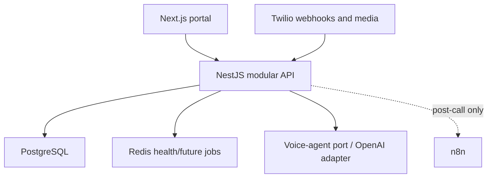

# EaziAiCall

EaziAiCall is an AI receptionist SaaS foundation built with Next.js, NestJS,
PostgreSQL, Redis, Twilio, OpenAI Realtime, Docker, and n8n. Module 0 preserves
the working call prototype while making its repository, configuration, database,
provider boundaries, webhook path, and validation workflow safer and repeatable.
Module 1 delivers end-to-end authentication (register, verify, session cookies,
password recovery, and portal route protection).

> Organization tenancy, roles, and the commercial ElevenLabs flow begin in later
> modules. The call-history API remains deliberately unavailable in production
> until tenant authorization (M02+) replaces the prototype guard.

## Architecture



PostgreSQL owns product data. Provider identifiers live in mapping records.
Realtime audio remains inside the API/provider path; n8n is reserved for
asynchronous post-call automation. Redis and object storage are non-authoritative
infrastructure ports.

## Safe Docker setup

Requirements: Docker with Compose v2, or Node.js 22 plus PostgreSQL 17 for local
development.

```bash
cp .env.docker.example .env.docker
cp ai-call-agent-backend/.env.docker.example ai-call-agent-backend/.env.docker
cp ai-call-agent-frontend/.env.docker.example ai-call-agent-frontend/.env.docker
```

Replace every `replace-with-...` value. Keep the Postgres password identical in
the root and backend files. Generate signing/encryption secrets with a secure
random generator, for example `openssl rand -hex 32`. Never commit the copied
files.

```bash
docker compose --env-file .env.docker config
docker compose --env-file .env.docker up --build
```

| Service     | Local address                        |
| ----------- | ------------------------------------ |
| Frontend    | `http://localhost:3001`              |
| Backend API | `http://localhost:3000/api/v1`       |
| Liveness    | `http://localhost:3000/health/live`  |
| Readiness   | `http://localhost:3000/health/ready` |
| PostgreSQL  | `localhost:5434`                     |
| Redis       | `localhost:6380`                     |
| n8n         | `http://localhost:5678`              |

The backend container runs reviewed TypeORM migrations before starting. Runtime
schema synchronization is disabled in every environment.

## Local development

```bash
cd ai-call-agent-backend
cp .env.example .env
npm ci
npm run migration:run
npm run start:dev
```

```bash
cd ai-call-agent-frontend
cp .env.example .env.local
npm ci
npm run dev
```

For a public Twilio smoke test, use an HTTPS tunnel as `PUBLIC_BASE_URL`, set
`TWILIO_VALIDATE_SIGNATURES=true`, provide a test Twilio auth token, and point
Twilio at:

- `POST /api/v1/webhooks/twilio/incoming-call`
- `POST /api/v1/webhooks/twilio/call-ended`

The generated TwiML binds a short-lived HMAC token to the Twilio Call SID. The
WebSocket gateway rejects media until that token is verified and applies message
and session limits.

## Validation

```bash
cd ai-call-agent-backend
npm run format:check
npm run lint
npm run typecheck
npm test
npm run test:e2e

cd ../ai-call-agent-frontend
npm run check
npm run build
```

CI repeats these checks on Node.js 22 with clean dependencies. Live provider
calls are opt-in and are never part of the default tests.

## Documentation

- [Target architecture and master module registry](AI_Receptionist_SaaS_Architecture_Module_Registry_Module_0.md)
- [Module 0 implementation report](docs/module-0/implementation-report.md)
- [Module 01 — Authentication](docs/module-1/README.md)
- [Baseline and validation evidence](docs/module-0/baseline-validation.md)
- [Runtime architecture](docs/module-0/runtime-architecture.md)
- [Database migration runbook](docs/module-0/migration-runbook.md)
- [Security and provider smoke-test runbook](docs/module-0/security-runbook.md)
- [Tenant-key strategy](docs/module-0/tenant-key-strategy.md)
- [Environment-variable strategy](docs/module-0/environment-strategy.md)
- [Module 1 auth API contracts](docs/module-1/api-contracts.md)

The internal directory names (`ai-call-agent-backend` and
`ai-call-agent-frontend`), npm package names, database name (`ai_call_agent`),
container names, and persistent volumes are intentionally unchanged in Module 0.
Renaming them is optional later cleanup after backups and deployment references
are reconciled.

## Clean exports

Source ZIPs must exclude `.git`, `node_modules`, `.next`, `dist`, `build`,
`coverage`, `.env`, `.env.local`, `.env.docker`, logs, and editor/OS metadata.
