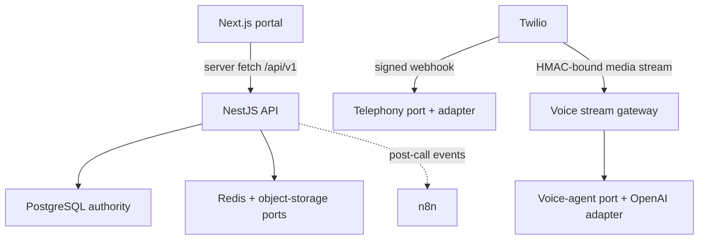

# Module 0 runtime architecture

## Request and call boundaries

## Ownership rules

| Concern                  | Owner in Module 0                                                  |
| ------------------------ | ------------------------------------------------------------------ |
| Product/call records     | PostgreSQL through TypeORM migrations                              |
| External call identity   | `call_provider_mappings` (`provider`, `external_call_id`)          |
| Webhook idempotency      | `provider_events` unique provider event identity plus payload hash |
| Telephony behavior       | `TelephonyProviderPort`; Twilio is the current adapter             |
| Conversational audio     | `VoiceAgentProviderPort`; OpenAI Realtime is the retained adapter  |
| Realtime execution       | NestJS WebSocket gateway, never n8n                                |
| Async automation         | n8n in later, post-call workflows only                             |
| Cache/queues             | Redis, non-authoritative; health foundation only in Module 0       |
| Durable binary originals | S3-compatible port; health foundation only in Module 0             |

## Security gates

1. HTTP webhook reaches the Twilio signature guard.
2. The adapter validates the signature against the exact public request URL and
   form parameters.
3. Incoming-call TwiML includes a short-lived HMAC token tied to the Call SID.
4. The media gateway waits for Twilio's `start` event and validates that binding.
5. Only then is the configured voice-agent connection opened.
6. Message-size and session-duration limits close abusive or stale streams.

## Module boundary ahead

Module 1 adds identity and route protection. Module 2 adds organization context
and tenant scoping. Module 0 intentionally refuses to pretend those controls
exist: the current call read API is a development-only prototype surface.
